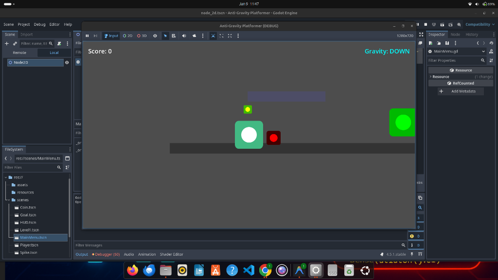

# Neon Shift 🌌

**Neon Shift** is a fast-paced, sci-fi 2D platformer where gravity is your tool, not your limit. Built with Godot Engine 4.


## 📸 Screenshots



## 🎮 About The Game

In **Neon Shift**, you control a gravity-defying agent navigating through hazardous neon-lit corridors. The catch? You can't just jump over obstacles—you have to flip the entire world's gravity to survive. 

Master momentum, avoid deadly lasers and spikes, and collect data cores (coins) to progress.

## ✨ Features

*   **Gravity Flipping Mechanic**: Seamlessly switch gravity up and down (`Tab` or `Shift`) to walk on ceilings and floor.
*   **Momentum-Based Physics**: Smooth movement that requires precision and timing.
*   **Neon Aesthetics**: A clean, modern sci-fi look with glowing visuals.
*   **Challenging Hazards**: Spikes, pits, and tricky platform placements.
*   **Godot 4 Powered**: Built using the latest stable version of the Godot Engine.

## 🕹️ Controls

| Action | Key(s) |
| :--- | :--- |
| **Move Left** | `Left Arrow` / `A` |
| **Move Right** | `Right Arrow` / `D` |
| **Jump** | `Space` / `Enter` / `Z` |
| **Flip Gravity** | `Tab` / `Shift` / `X` |

## 🚀 How to Run

### Prerequisites
*   [Godot Engine 4.x](https://godotengine.org/download) (Standard Version recommended)

### Installation
1.  **Clone the repository**:
    ```bash
    git clone https://github.com/Annu881/2D-game.git
    ```
2.  **Import into Godot**:
    *   Open Godot Engine.
    *   Click **Import**.
    *   Select the `project.godot` file from the cloned folder.
3.  **Play**:
    *   Press `F5` to run the game from the editor.

## 🛠️ Built With

*   **Engine**: [Godot 4](https://godotengine.org/)
*   **Language**: GDScript
*   **Graphics**: Custom Vector Assets (SVG)

## 🤝 Contributing

Contributions are welcome! If you have ideas for new levels or mechanics:
1.  Fork the project.
2.  Create your feature branch (`git checkout -b feature/AmazingFeature`).
3.  Commit your changes (`git commit -m 'Add some AmazingFeature'`).
4.  Push to the branch (`git push origin feature/AmazingFeature`).
5.  Open a Pull Request.

---
*Created by [Annu881](https://github.com/Annu881)*
